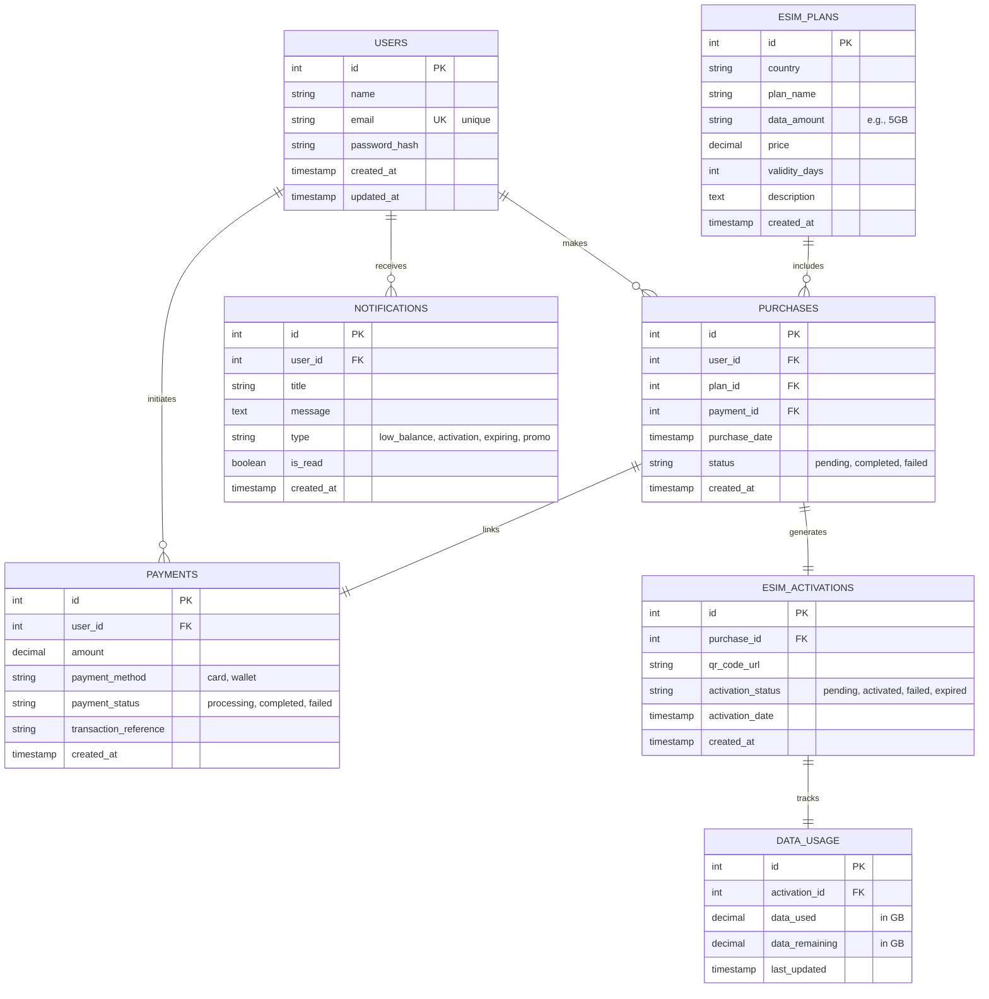

# eSIM Travel App - Database Schema Diagram

## Entity Relationship Diagram (ER Diagram)



---

## Core Tables & Relationships

### 1. **USERS Table** - User Accounts
Stores user profile and authentication data.

```sql
CREATE TABLE USERS (
    id INT PRIMARY KEY AUTO_INCREMENT,
    name VARCHAR(255) NOT NULL,
    email VARCHAR(255) NOT NULL UNIQUE,
    password_hash VARCHAR(255) NOT NULL,
    created_at TIMESTAMP DEFAULT CURRENT_TIMESTAMP,
    updated_at TIMESTAMP DEFAULT CURRENT_TIMESTAMP ON UPDATE CURRENT_TIMESTAMP,
    is_active BOOLEAN DEFAULT TRUE
);
```

| Field | Type | Purpose |
|-------|------|---------|
| **id** | INT PK | Unique user identifier |
| **name** | VARCHAR(255) | Full user name |
| **email** | VARCHAR(255) UNIQUE | Login credential & contact |
| **password_hash** | VARCHAR(255) | Bcrypt/Argon2 hashed password |
| **created_at** | TIMESTAMP | Account creation date |
| **updated_at** | TIMESTAMP | Last profile update |
| **is_active** | BOOLEAN | Account active status |

**Relationships:**
- One user → Many purchases
- One user → Many payments
- One user → Many notifications

---

### 2. **ESIM_PLANS Table** - Available Plans
Stores all eSIM plan offerings by country.

```sql
CREATE TABLE ESIM_PLANS (
    id INT PRIMARY KEY AUTO_INCREMENT,
    country VARCHAR(100) NOT NULL,
    plan_name VARCHAR(255) NOT NULL,
    data_amount VARCHAR(50) NOT NULL,
    data_amount_gb INT NOT NULL,
    price DECIMAL(10, 2) NOT NULL,
    validity_days INT NOT NULL,
    description TEXT,
    is_active BOOLEAN DEFAULT TRUE,
    created_at TIMESTAMP DEFAULT CURRENT_TIMESTAMP
);
```

| Field | Type | Purpose |
|-------|------|---------|
| **id** | INT PK | Unique plan identifier |
| **country** | VARCHAR(100) | Country name (e.g., Japan, Thailand) |
| **plan_name** | VARCHAR(255) | Marketing name (e.g., "Japan 20GB") |
| **data_amount** | VARCHAR(50) | Human-readable (e.g., "20GB") |
| **data_amount_gb** | INT | Numeric GB for calculations |
| **price** | DECIMAL(10,2) | Plan cost |
| **validity_days** | INT | How long plan is valid |
| **description** | TEXT | Full plan details & terms |
| **is_active** | BOOLEAN | Available for purchase |
| **created_at** | TIMESTAMP | Plan creation date |

**Relationships:**
- One plan → Many purchases

---

### 3. **PURCHASES Table** - Buy Transactions
Records each purchase transaction.

```sql
CREATE TABLE PURCHASES (
    id INT PRIMARY KEY AUTO_INCREMENT,
    user_id INT NOT NULL,
    plan_id INT NOT NULL,
    payment_id INT,
    purchase_date TIMESTAMP DEFAULT CURRENT_TIMESTAMP,
    status ENUM('pending', 'completed', 'failed', 'cancelled') DEFAULT 'pending',
    created_at TIMESTAMP DEFAULT CURRENT_TIMESTAMP,
    FOREIGN KEY (user_id) REFERENCES USERS(id) ON DELETE CASCADE,
    FOREIGN KEY (plan_id) REFERENCES ESIM_PLANS(id) ON DELETE RESTRICT,
    FOREIGN KEY (payment_id) REFERENCES PAYMENTS(id)
);
```

| Field | Type | Purpose |
|-------|------|---------|
| **id** | INT PK | Unique purchase identifier |
| **user_id** | INT FK | User making purchase |
| **plan_id** | INT FK | Plan being purchased |
| **payment_id** | INT FK | Linked payment record |
| **purchase_date** | TIMESTAMP | When purchased |
| **status** | ENUM | pending → completed → active |
| **created_at** | TIMESTAMP | Record creation time |

**Status Workflow:**
```
pending → completed (successful)
pending → failed (payment declined)
completed → cancelled (refund)
```

**Relationships:**
- Many-to-one with USERS (N users make 1 purchase each)
- Many-to-one with ESIM_PLANS (N purchases of 1 plan)
- One-to-one with PAYMENTS (1 payment per purchase)
- One-to-one with ESIM_ACTIVATIONS (generates 1 eSIM)

---

### 4. **PAYMENTS Table** - Payment Transactions
Stores payment processing and transaction details.

```sql
CREATE TABLE PAYMENTS (
    id INT PRIMARY KEY AUTO_INCREMENT,
    user_id INT NOT NULL,
    purchase_id INT,
    amount DECIMAL(10, 2) NOT NULL,
    payment_method VARCHAR(50) NOT NULL,
    payment_status ENUM('processing', 'completed', 'failed', 'refunded') DEFAULT 'processing',
    transaction_reference VARCHAR(255) NOT NULL UNIQUE,
    processor_transaction_id VARCHAR(255),
    card_brand VARCHAR(50),
    last_four_digits VARCHAR(4),
    created_at TIMESTAMP DEFAULT CURRENT_TIMESTAMP,
    FOREIGN KEY (user_id) REFERENCES USERS(id) ON DELETE CASCADE,
    FOREIGN KEY (purchase_id) REFERENCES PURCHASES(id)
);
```

| Field | Type | Purpose |
|-------|------|---------|
| **id** | INT PK | Unique payment identifier |
| **user_id** | INT FK | User making payment |
| **purchase_id** | INT FK | Linked purchase |
| **amount** | DECIMAL(10,2) | Payment amount |
| **payment_method** | VARCHAR(50) | card, wallet, bank transfer |
| **payment_status** | ENUM | processing → completed/failed |
| **transaction_reference** | VARCHAR(255) UNIQUE | Internal TX reference |
| **processor_transaction_id** | VARCHAR(255) | 3rd party processor ID |
| **card_brand** | VARCHAR(50) | Visa, Mastercard, etc. |
| **last_four_digits** | VARCHAR(4) | Card last 4 (display only) |
| **created_at** | TIMESTAMP | Transaction time |

**Security Note:** Never store full card numbers; use processor tokenization.

---

### 5. **ESIM_ACTIVATIONS Table** - eSIM Delivery & Activation
Tracks eSIM QR code generation and activation status.

```sql
CREATE TABLE ESIM_ACTIVATIONS (
    id INT PRIMARY KEY AUTO_INCREMENT,
    purchase_id INT NOT NULL UNIQUE,
    iccid VARCHAR(20) NOT NULL UNIQUE,
    qr_code_url VARCHAR(500),
    activation_status ENUM('pending', 'activated', 'failed', 'expired') DEFAULT 'pending',
    activation_code VARCHAR(255),
    activation_date TIMESTAMP,
    expiry_date TIMESTAMP,
    created_at TIMESTAMP DEFAULT CURRENT_TIMESTAMP,
    FOREIGN KEY (purchase_id) REFERENCES PURCHASES(id) ON DELETE CASCADE
);
```

| Field | Type | Purpose |
|-------|------|---------|
| **id** | INT PK | Unique activation identifier |
| **purchase_id** | INT FK UNIQUE | 1:1 with purchase |
| **iccid** | VARCHAR(20) UNIQUE | Integrated Circuit Card ID |
| **qr_code_url** | VARCHAR(500) | URL to QR code image |
| **activation_status** | ENUM | pending → activated → expired |
| **activation_code** | VARCHAR(255) | Manual activation fallback |
| **activation_date** | TIMESTAMP | When user activated |
| **expiry_date** | TIMESTAMP | When eSIM expires |
| **created_at** | TIMESTAMP | QR generation time |

**Status Lifecycle:**
```
pending → activated (user scans QR)
pending → failed (delivery error)
activated → expired (plan ends)
```

---

### 6. **DATA_USAGE Table** - Usage Tracking
Monitors real-time data consumption per activation.

```sql
CREATE TABLE DATA_USAGE (
    id INT PRIMARY KEY AUTO_INCREMENT,
    activation_id INT NOT NULL UNIQUE,
    data_used DECIMAL(10, 2) NOT NULL DEFAULT 0,
    data_total DECIMAL(10, 2) NOT NULL,
    data_remaining DECIMAL(10, 2) NOT NULL,
    usage_percentage INT GENERATED ALWAYS AS (ROUND((data_used / data_total) * 100)) STORED,
    last_updated TIMESTAMP DEFAULT CURRENT_TIMESTAMP ON UPDATE CURRENT_TIMESTAMP,
    FOREIGN KEY (activation_id) REFERENCES ESIM_ACTIVATIONS(id) ON DELETE CASCADE
);
```

| Field | Type | Purpose |
|-------|------|---------|
| **id** | INT PK | Unique usage record ID |
| **activation_id** | INT FK UNIQUE | 1:1 with activation |
| **data_used** | DECIMAL(10,2) | GB consumed |
| **data_total** | DECIMAL(10,2) | GB allocated |
| **data_remaining** | DECIMAL(10,2) | GB available |
| **usage_percentage** | INT GENERATED | Auto-calculated (0-100%) |
| **last_updated** | TIMESTAMP | Last sync from network |

**Auto-Calculation:**
```
data_remaining = data_total - data_used
usage_percentage = (data_used / data_total) * 100
```

---

### 7. **NOTIFICATIONS Table** - User Alerts
Stores all user notifications and alerts.

```sql
CREATE TABLE NOTIFICATIONS (
    id INT PRIMARY KEY AUTO_INCREMENT,
    user_id INT NOT NULL,
    purchase_id INT,
    activation_id INT,
    title VARCHAR(255) NOT NULL,
    message TEXT NOT NULL,
    type VARCHAR(50) NOT NULL,
    action_url VARCHAR(500),
    is_read BOOLEAN DEFAULT FALSE,
    read_at TIMESTAMP,
    priority ENUM('low', 'normal', 'high') DEFAULT 'normal',
    created_at TIMESTAMP DEFAULT CURRENT_TIMESTAMP,
    FOREIGN KEY (user_id) REFERENCES USERS(id) ON DELETE CASCADE,
    FOREIGN KEY (purchase_id) REFERENCES PURCHASES(id) ON DELETE SET NULL,
    FOREIGN KEY (activation_id) REFERENCES ESIM_ACTIVATIONS(id) ON DELETE SET NULL
);
```

| Field | Type | Purpose |
|-------|------|---------|
| **id** | INT PK | Unique notification ID |
| **user_id** | INT FK | User receiving alert |
| **purchase_id** | INT FK | Related purchase (if any) |
| **activation_id** | INT FK | Related activation (if any) |
| **title** | VARCHAR(255) | Notification title |
| **message** | TEXT | Alert message |
| **type** | VARCHAR(50) | Notification category |
| **action_url** | VARCHAR(500) | Deep link to app screen |
| **is_read** | BOOLEAN | Read status |
| **read_at** | TIMESTAMP | When user read it |
| **priority** | ENUM | Display priority |
| **created_at** | TIMESTAMP | Alert creation time |

**Notification Types:**
- `low_balance` - Data below 10%
- `activation` - eSIM successfully activated
- `expiring_soon` - Plan expires within 7 days
- `plan_expired` - Plan has expired
- `promo` - Promotional offer
- `payment_failed` - Payment declined

---

## Relationship Summary

### One-to-Many (1:N)
| From | To | Constraint |
|------|----|----|
| USERS | PURCHASES | ON DELETE CASCADE |
| USERS | PAYMENTS | ON DELETE CASCADE |
| USERS | NOTIFICATIONS | ON DELETE CASCADE |
| ESIM_PLANS | PURCHASES | ON DELETE RESTRICT |

### One-to-One (1:1)
| From | To | Constraint |
|------|----|----|
| PURCHASES | PAYMENTS | Foreign key on PURCHASES |
| PURCHASES | ESIM_ACTIVATIONS | UNIQUE on purchase_id |
| ESIM_ACTIVATIONS | DATA_USAGE | UNIQUE on activation_id |

---

## Data Flow Diagram

```
User Registration
    ↓
[USERS table created]
    ↓
Browse Plans
    ↓
[Query ESIM_PLANS table]
    ↓
Select & Purchase Plan
    ↓
[Create PURCHASES record (pending)]
    ↓
Payment Processing
    ↓
[Create PAYMENTS record] → payment_status: processing
    ↓
Payment Approved
    ↓
[Update PAYMENTS: status = completed]
[Update PURCHASES: status = completed, payment_id set]
    ↓
Generate eSIM
    ↓
[Create ESIM_ACTIVATIONS with QR code]
[activation_status = pending]
    ↓
User Scans QR Code
    ↓
[Update ESIM_ACTIVATIONS: activation_status = activated]
[Create DATA_USAGE record]
[Create NOTIFICATION: "eSIM Activated"]
    ↓
Real-Time Usage Sync
    ↓
[Update DATA_USAGE: data_used, data_remaining, usage_percentage]
[Monitor for low balance]
    ↓
Low Balance Detected (< 10%)
    ↓
[Create NOTIFICATION: "Low Balance"]
    ↓
User Purchases Top-Up
    ↓
[Repeat Purchase → Payment → eSIM Activation flow]
```


