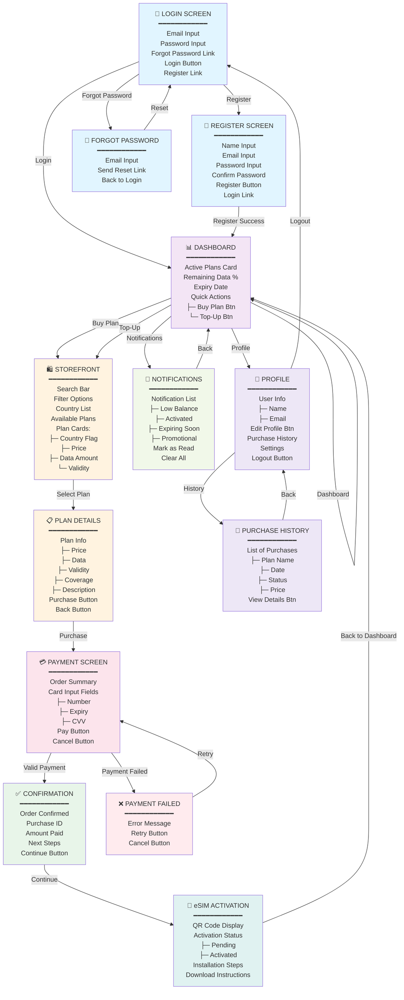

# eSIM Travel App - Wireframe Diagram

## Complete Navigation Flow & Screen Architecture



---

## Screen Architecture Overview

### Authentication Flow
| Screen | Purpose | Key Components | Navigation |
|--------|---------|-----------------|-----------|
| **Login** | User authentication | Email, Password, Forgot Password link, Login button | → Dashboard on success → Register → Forgot Password |
| **Register** | New account creation | Name, Email, Password, Confirm Password, Terms | → Dashboard on success → Login |
| **Forgot Password** | Password recovery | Email input, Send Reset Link | → Login after reset |

### Main Navigation (Bottom Tab Bar - 4 Tabs)
1. **Dashboard** (Home) - Active plans, quick actions
2. **Storefront** (Browse) - Plan catalogue, search, filter
3. **Notifications** - User alerts
4. **Profile** - Account settings, purchase history

### Core Features

#### Dashboard
- **Active Plans Card**: Shows current eSIM plan with data usage percentage
- **Remaining Data**: Visual progress bar and percentage indicator
- **Expiry Countdown**: Days remaining until plan expires
- **Quick Actions**: 
  - Buy Plan button → Storefront
  - Top-Up button → Storefront filtered

#### Storefront (Plan Catalogue)
- **Search Bar**: Find plans by country name
- **Filter Options**: Price, data amount, validity period
- **Country Tabs**: Horizontal carousel of country flags
- **Plan Cards**: 
  - Country flag + name
  - Price (primary highlight)
  - Data amount (e.g., "20GB")
  - Validity (e.g., "30 Days")
  - Select button

#### Plan Details
- **Full Plan Information**: 
  - Price breakdown
  - Data type (high-speed/standard)
  - Validity days
  - Coverage areas
  - Description & terms
- **Action Buttons**:
  - Purchase Now (primary)
  - Add to Wishlist (optional)
  - Back button

#### Payment Flow (3 Screens)
1. **Payment Screen**:
   - Order summary (static)
   - Payment method selection
   - Card input fields (PAN, Expiry, CVV, Name)
   - Pay button
   - Security badge

2. **Confirmation Screen**:
   - Success checkmark
   - Order ID & confirmation number
   - Amount paid
   - Continue to Activation button

3. **Payment Failed Screen**:
   - Error message with reason
   - Retry Payment button
   - Change Payment Method option
   - Cancel Order button

#### eSIM Activation
- **QR Code Display**: Large, scannable QR code
- **Status Badge**: Pending → Activated → Active
- **Installation Instructions**: Step-by-step guide
- **Manual Entry Option**: For users who can't scan
- **Data Preview**: Current balance, usage, expiry (if activated)

#### Notifications
- **Notification List**: 
  - Low Balance warnings
  - Activation success alerts
  - Plan expiring soon reminders
  - Promotional offers
  - System notifications
- **Actions**: Mark as read, archive, delete

#### Profile
- **User Information**: Name, email, member since date
- **Account Actions**:
  - Edit Profile
  - Change Password
  - Preferences/Settings
- **Purchase History**: View all past purchases with details
- **Support**:
  - FAQ
  - Contact Support
  - Report Issue
- **Logout**: With confirmation

---

## Screen Statistics

| Metric | Count |
|--------|-------|
| **Total Screens** | 9 primary screens |
| **Authentication Screens** | 3 |
| **Main Navigation Screens** | 4 |
| **Transaction Screens** | 3 |
| **Detail/Modal Screens** | 2+ |
| **Navigation Tabs** | 4 (bottom nav bar) |
| **User Flows** | Purchase, Activation, Notification, Profile |

---

## User Journey Highlights

### New User Flow
```
Login/Register → Dashboard → Browse Plans → View Details → 
Purchase → Payment → Confirmation → eSIM Activation → 
Scan QR → Active
```

### Returning User Flow
```
Dashboard → Check Active Plans & Data → 
Top-Up/Buy Plan → Payment → eSIM Setup
```

### Data Management Flow
```
Dashboard (Data Usage %) → Notifications (Low Balance) → 
Buy Plan → Payment → New Plan Activated
```

## Navigation Patterns

### Primary Navigation
- **Bottom Tab Bar**: Persistent navigation across 4 main screens
  - Dashboard (home icon)
  - Browse (shop icon)
  - Notifications (bell icon)
  - Profile (account icon)

### Secondary Navigation
- **App Bar**: Top navigation with back button, title, action icons
- **Modals**: Purchase history, edit profile
- **Deep Links**: Notification taps navigate to relevant screens

### Back Navigation
- Hardware/Software back button follows Android conventions
- App bar up button for modal/detail screens
